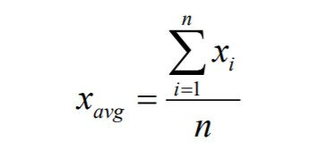
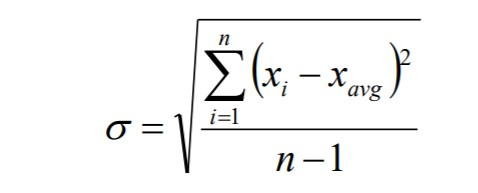
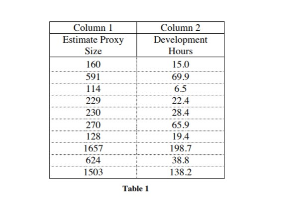
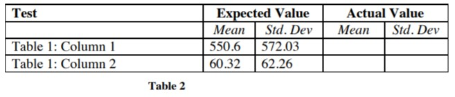
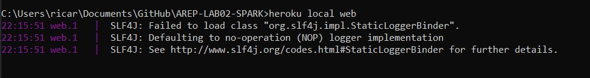
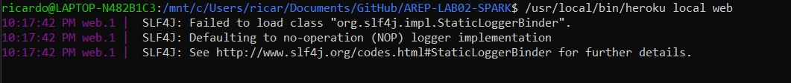
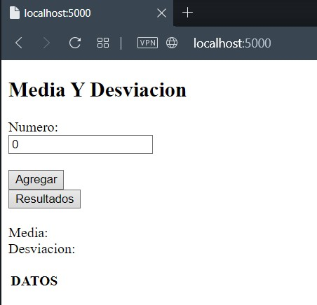
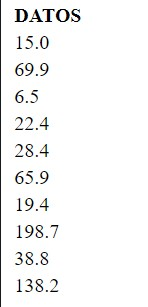
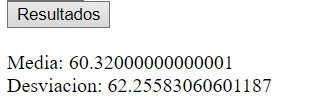

# AREP - Laboratorio #2
El ejercicio consiste en realizar un programa para calcular la media y la desviación estándar de un conjunto de datos leídos desde un archivo.
Además se requiere crear una implementación de listas enlazadas (linked list) para el manejo de los datos.

## Definiciones

### Lista Enlazada (Linked List)
Las listas enlazadas son un tipo de datos abstractos comunes que se utilizan para mantener colecciones de datos.

Las listas enlazadas se implementan con punteros.
Una lista vinculada generalmente tiene dos componentes.
* Encabezado de lista
* Lista de nodo(s)

### Media
La media es el promedio de un conjunto de datos.

### Desviación estándar
La desviación estándar es una medida de la extensión o dispersión de un conjunto de datos.
Cuanto mayor sea la dispersión de los valores, mayor será la desviación estándar. 

### Fórmulas

Media

Desviación estándar

El enunciado del ejercicio ya nos da dos tablas con información, una con los datos y otra con los resultados de la media y la desviación estándar. Los datos de la tabla 1 se encuentran en la carpeta [data](data) del repositorio y el resultado que da este programa puede observarlo en la sección de [ejemplos](#Ejemplos) y compararlo con el resultado en la tabla 2.

## Comenzando 
Para obtener una copia local del repositorio puede ejecutar la siguiente línea en la consola de comandos.
    
    git clone https://github.com/Ricar8o/AREP-LAB02-SPARK.git

## Pre-requisitos

Debe tener instalado lo siguiente:

* [GIT](https://git-scm.com/book/es/v2/Inicio---Sobre-el-Control-de-Versiones-Instalación-de-Git)
* [JAVA 8](https://www.java.com/es/download/)
* [MAVEN](https://maven.apache.org)

GIT no es completamente necesario pero si es recomendable, también puede descargar el repositorio como un .zip.

## Otras Tecnologías
* [Heroku](www.heroku.com) - Es una plataforma como servicio (PaaS) que permite a los desarrolladores crear, ejecutar y operar aplicaciones completamente en la nube.
* [Spark Framework](http://sparkjava.com) - Es un framework web de desarrollo rápido inspirado en el framework Sinatra para Ruby y se basa en la filosofía Java 8 Lambda Expression.

## Pruebas y Compilación

Para compilar el proyecto podemos ejecutar varias opciones. 

* Para compilar el codigo fuente únicamente.

        mvn compile
* Para ejecutar las pruebas.

        mvn test
* Para ejecutar todas las fases.

        mvn package

## Ejecución
Para ejecutar el programa puede hacerlo desle la linea de comandos ejecutando cualquiera de las siguientes opciones.

### Windows
        java -cp target/classes;target/dependency/* edu.escuelaing.arep.designprimer.CalculatorWebApp
### Linux
        java -cp target/classes:target/dependency/* edu.escuelaing.arep.designprimer.CalculatorWebApp

En ambos casos se ejecutara en http://localhost:4567

### Heroku (Opcional)
Si tiene instalado heroku puede ejecutar el siguiente comando en la carpeta del repositorio:
        heroku local web

NOTA: 
En el repositorio se encuentra un archivo llamado [Procfile](/Procfile).

Si esta en linux deberia ejecutarse sin problema, en el caso de que este en windows basta con cambiar los dos puntos ":" por un punto y coma ";" y borrar la parte "$JAVA_OPTS".
 
## Desplegando de manera local

Al ejecutar.

Para el ejemplo lo demostraremos con heroku.
### Windows

### Linux

Como se ve, en ambos casos pasa exactamente lo mismo y se abre un servidor, con heroku se nos abrira por el puerto 5000. Así que la dirección es http://localhost:5000

Al ingresar veremos la siguiente página

Después de agregar cada dato, este se podrá observar en la tabla de datos. La aplicación ya valida que solo pueda digitar números, si ingresa letras o espacios vacíos no registra nada.

Al oprimir el botón de Resultados, nos mostrará la media y la desviación estándar de estos.

## Despliegue en heroku 
Si quiere ver como funciona la pagina de este repositorio de click a [CalculatorWebApp](https://pacific-taiga-95644.herokuapp.com)

## Documentación

La documentacion se encuentra en la carpeta del repositorio llamada [docs](docs), pero en caso de que quiera generarla tiene las siguientes opciones.

### Maven
Para generar la documentacion con Maven puede ejecutar cualquiera de los siguientes comandos.

*        mvn javadoc:javadoc
*        mvn javadoc:jar

## PDF Diseño

[Arep_Lab_2.PDF](Arep_Lab_2.pdf)

## Autor 

Andrés Ricardo Martínez Díaz - [Ricar8o](https://github.com/Ricar8o)

## Licencia
Mire el archivo [LICENSE.md](LICENSE) para más detalles.
